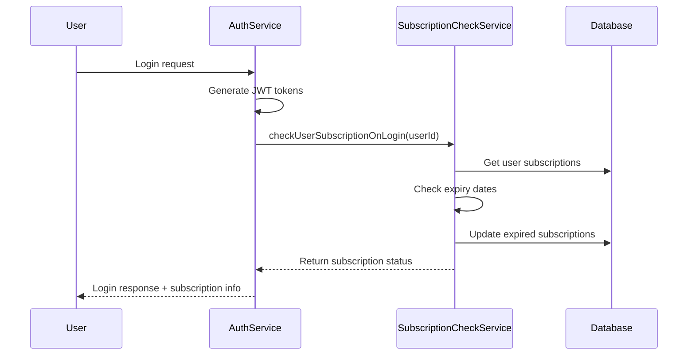

# Subscription Check on Login - Tài liệu hướng dẫn

## Tổng quan

Tính năng **Subscription Check on Login** tự động kiểm tra và cập nhật trạng thái đăng ký của người dùng mỗi khi họ đăng nhập vào hệ thống.

## Chức năng

### 1. **Kiểm tra tự động khi đăng nhập**

- Mỗi khi user đăng nhập (Google OAuth web hoặc mobile), hệ thống sẽ tự động:
  - Kiểm tra trạng thái subscription hiện tại
  - Cập nhật subscription đã hết hạn
  - Trả về thông tin subscription trong response

### 2. **Cập nhật trạng thái tự động**

- **ACTIVE → EXPIRED**: Tự động chuyển subscription đã hết hạn
- **Kiểm tra ngày hết hạn**: So sánh với thời gian hiện tại
- **Lưu log**: Ghi lại mọi thay đổi trạng thái

### 3. **Response có thông tin subscription**

```json
{
  "tokens": {
    "accessToken": "jwt_token",
    "refreshToken": "refresh_token"
  },
  "subscription": {
    "hasActiveSubscription": true,
    "subscriptionStatus": "active",
    "subscriptionDetails": {
      "id": "subscription-id",
      "startDate": "2024-01-01T00:00:00Z",
      "endDate": "2024-02-01T00:00:00Z",
      "daysRemaining": 15,
      "plan": {
        "name": "Premium Plan",
        "price": 50000,
        "durationDays": 30
      }
    },
    "message": "Active subscription found"
  }
}
```

## Các trường hợp xử lý

### 1. **User có subscription ACTIVE (chưa hết hạn)**

```json
{
  "hasActiveSubscription": true,
  "subscriptionStatus": "active",
  "subscriptionDetails": {
    "id": "sub-123",
    "daysRemaining": 15,
    "plan": { "name": "Premium" }
  },
  "message": "Active subscription found"
}
```

### 2. **User có subscription ACTIVE nhưng đã hết hạn**

- Hệ thống tự động cập nhật status → `EXPIRED`
- Trả về trạng thái mới:

```json
{
  "hasActiveSubscription": false,
  "subscriptionStatus": "expired",
  "message": "No active subscription found"
}
```

### 3. **User có subscription PENDING**

```json
{
  "hasActiveSubscription": false,
  "subscriptionStatus": "pending",
  "subscriptionDetails": {
    "id": "sub-456",
    "status": "pending",
    "plan": { "name": "Premium", "price": 50000 }
  },
  "message": "Subscription payment pending"
}
```

### 4. **User chưa có subscription**

```json
{
  "hasActiveSubscription": false,
  "subscriptionStatus": null,
  "subscriptionDetails": null,
  "message": "No subscriptions found"
}
```

## API Endpoints

### 1. **Google Login (Web)**

```http
GET /auth/google/callback
```

Response sẽ include thông tin subscription.

### 2. **Google Login (Mobile)**

```http
POST /auth/google/mobile
Content-Type: application/json

{
  "id_token": "google_id_token"
}
```

Response sẽ include thông tin subscription.

### 3. **Check Subscription Status riêng**

```http
GET /auth/subscription-status
Authorization: Bearer {access_token}
```

Response:

```json
{
  "hasActiveSubscription": true,
  "subscriptionStatus": "active",
  "subscriptionDetails": { ... },
  "message": "Active subscription found",
  "checkTimestamp": "2024-01-15T10:30:00Z"
}
```

## Kiến trúc

### Services

1. **SubscriptionCheckService**: Logic chính để check và update subscription
2. **AuthService**: Tích hợp subscription check vào login flow
3. **UserSubscriptionService**: CRUD operations cho subscription

### Flow



## Cấu hình

Không cần cấu hình thêm. Tính năng sẽ hoạt động tự động khi:

- UserSubscriptionModule được import
- SubscriptionCheckService được inject vào AuthService

## Error Handling

- **Lỗi khi check subscription**: Login vẫn thành công, chỉ log warning
- **Database error**: Subscription info sẽ là `null` nhưng login vẫn thành công
- **Service không khả dụng**: Graceful fallback, không ảnh hưởng login

## Logging

Service ghi log các hoạt động:

```
[SubscriptionCheckService] Checking subscription for user: {userId}
[SubscriptionCheckService] Updating expired subscription: {subscriptionId}
[SubscriptionCheckService] Active subscription found for user {userId}: {subscriptionId}
```

## Testing

### Test Case 1: User với active subscription

```javascript
// Mock user có subscription active, chưa hết hạn
// Expected: hasActiveSubscription = true, status = active
```

### Test Case 2: User với expired subscription

```javascript
// Mock user có subscription active nhưng đã hết hạn
// Expected: Tự động update thành expired, hasActiveSubscription = false
```

### Test Case 3: User với pending subscription

```javascript
// Mock user có subscription pending payment
// Expected: hasActiveSubscription = false, status = pending
```

### Test Case 4: User không có subscription

```javascript
// Mock user chưa có subscription nào
// Expected: hasActiveSubscription = false, status = null
```

## Best Practices

1. **Non-blocking**: Lỗi subscription check không làm fail login
2. **Performance**: Cache subscription data nếu cần thiết
3. **Consistency**: Update subscription status ngay tại thời điểm login
4. **Monitoring**: Log tất cả subscription status changes
5. **Security**: Chỉ trả về thông tin subscription cần thiết

## Troubleshooting

### Lỗi thường gặp:

1. **Subscription không update**: Kiểm tra UserSubscriptionService
2. **Thiếu thông tin plan**: Kiểm tra relations trong query
3. **Performance chậm**: Optimize database queries và indexing
4. **Sai thời gian hết hạn**: Kiểm tra timezone settings

### Debug:

```bash
# Check logs
grep "SubscriptionCheckService" /var/log/app.log

# Test endpoint trực tiếp
curl -H "Authorization: Bearer {token}" \
     http://localhost:3000/auth/subscription-status
```
